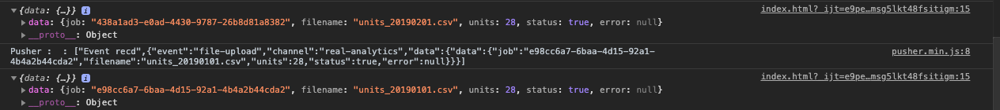
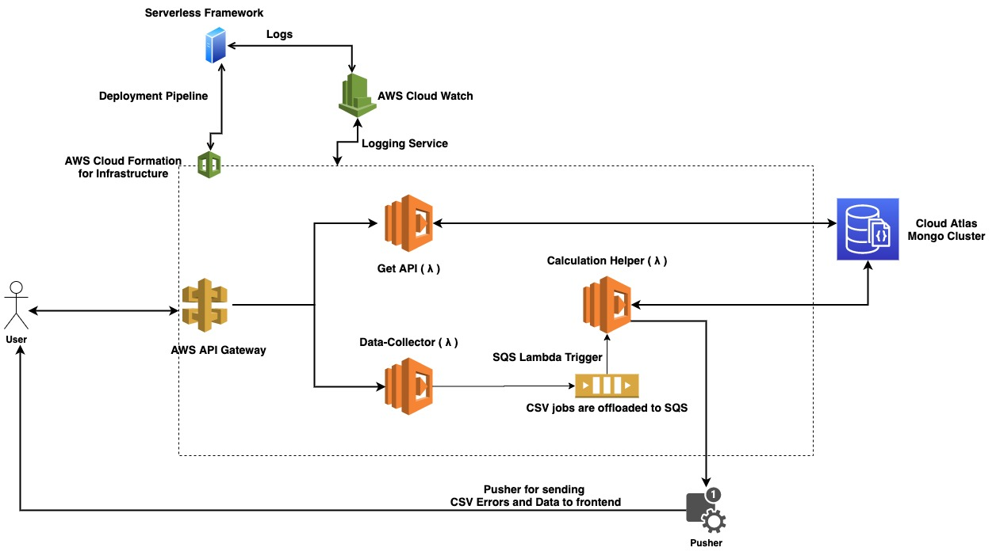
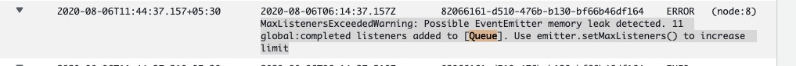

## Real Analytics API

**Live @ [AWS lambda](https://i8bsrn67me.execute-api.ap-south-1.amazonaws.com/production/v1/data-collector/status)** 

### Prerequisites 
1. Docker up and running
2. Node and npm installed
3. aws-cli
4. [Postman Collection](https://thecompiler.postman.co/collections/2822837-75f4c22e-2702-41d2-a33f-8396ca1d5c21
/publish?workspace=c86c0053-bd08-4613-8385-f6586ff09405) or [goto](./docs/)  for the collection and env
 collection and the environment
 
### Listing API Route params
```{{base_url}}/data-delivery/asset```
1. limit=Number
2. skip=Number
3. field=city&order=ASC [asc, desc, 1, -1 ]

### Pusher Test UI
1. Goto [docs/index.html](./docs/index.html)
2. Serve the index.html via a http server or open it using chrome
3. open the console for the output from pusher
 
 

### Pusher Errors 
Sample error thrown while formatting the CSV
```json
{
   "data":{
      "error":"Invalid Keys: {}",
      "filename":"crisis2.csv",
      "job":"ckdhvpjls0002zk6ydomg6liw",
      "status":false
   }
}
```

### How to run locally
Skip if you have already setup the following.
1. On AWS console, create a aws user for serverless framework (lambda, ynamo db, cloud formation, IAM, AWS API gateway)
    ````shell script
    $ pip3 install awscli
    $ aws --version
    # configure aws-cli by setting the aws credentials 
    $ aws login 
    ````
2. install serverless framework
    ```shell script
    $ npm install -g serverless
    $ sls login
    # create a serverless app on dashboard   
    $ serverless --org {organization name} --app real-analytics
    ```
3. Run the Mongodb locally
    ```shell script
    docker run -p 27017:27017 {Docker Container name}
    ```
4. Create a Serverless framework account for local deployment automation 
5. install npm packages inside the project
    ```shell script
    npm i
    ```
6. Set the .env configuration according to the environment
- Example .env names:
    1. .env.development
    2. .env.testing
    3. .env.production
    4. .env.${name_of_the_env}

```
# Please create a IAM user on AWS with programatic access
# The AWS user should have Lambda, SQS, Clouds Watch, Cloud Formation, S3, EC2 rights
# AWS Access key Id
L_AWS_ACCESS_KEY=

# AWS Access key Secret
L_AWS_SECRET=

# AWS Region ex: ap-south-1
L_AWS_REGION=

# Application Name
APP_NAME=real-analytics

# Application Environment [development, production, testing]
NODE_ENV=

# JWT Config is not required for this
#JWT_SECRET=
#JWT_ALGORITHM=
#JWT_EXP=1d

# Please run mongodb on your local machine or on a host like Cloud Atlas and enter the parameters
# Mongodb database connection parameters, the name can be anything

# Database name
DB_NAME=real-analytics

# Database host url
DB_HOST=

# Database port
DB_PORT=

# Database password
DB_PASSWORD=

# Database username
DB_USER=

# Redis cluster is not required. It is deprecated since the introduction os SQS
#REDIS_ENDPOINT=
#REDIS_PASSWORD=
#REDIS_PORT=

# Please create a free pusher account and input the following parameters

# pusher application Id
PUSHER_APP_ID

# Pusher application key
PUSHER_KEY=

# pusher secret
PUSHER_SECRET=

# Pusher Cluster Region ex: ap2
PUSHER_CLUSTER=
```
    
7. Add the offline plugin to serverless framework 
 ```yaml
     plugins:
       - serverless-dotenv-plugin
       - serverless-offline
 ```
8. Run the project
```shell script
 sls offline start --stage development 
```  
### Unit tests
* test cases covering the delivery operations.

 ```shell script
  npm run test
 ```
### Important commands
   
##### Invoke functions individually  
```shell script
  sls invoke local -f {function name} --stage {environment} 
```
##### Deploy to AWS
```shell script
  sls deploy --stage production
```

##### Remove from production
```shell script
    sls remove --stage production
```
### Discussion

 The application is naturally scalable since lambda can be scaled function wise. Breaking a tightly coupled API logic
  into small functions gives room for extending, scaling and improves testability. Also the get api is independant of
   the less frequently used CSV upload utility. 

### Problems and Assumptions 
1. Following unit has a tenant and a lease period but is not rented - Assumed that the tenent has already made the
 payment till the agreement ends)
```shell script
 {
      _id: 5f21d6f5ceafb71f5beafb38,
      ref: 'A_5_5',
      timestamp: '01.02.19',
      __v: 0,
      asset: [Object],
      createdAt: 2020-07-29T20:07:17.717Z,
      is_rented: false,
      lease_end: '01.02.20',
      lease_start: '01.02.19',
      rent: 600,
      size: 60,
      tenant: 'Stephania Sagers',
      type: 'RESIDENTIAL',
      updatedAt: 2020-08-04T16:35:17.993Z
    }

```
2. Some units didn't have a lease end date, therefore I didn't calculate the WALT value since it will high
3. Some units were occupied by the same tenant. Therefore I calculated the occupancy area as the addition of all
 areas occupied by the tenant under the asset.
4. The CSV files will be added newly only if the timestamp is different. If it's same, it will update the data
 already in the database if exists, else it will create the missing data.
    
### Architectural diagram and a brief summary.
 
 

<hr>

* The Architecture is based on the concept of FaaS hosted on AWS(Other cloud providers also supports this).
* The main reason to go serverless is that the CSV service will be used mostly 10 times a day and the get api will be
 used as required. Therefore, we can save the COST according to the execution time rather than having a dedicated
  server running all the time. Also Scaling is not a problem
* The CSV is taken through the /store route of the data collector and will be parsed to a json, then validates the
 keys
 * After this if everything is valid, the data will be passed to AWS SQS for further processing and
  stored in the database
  * The errors happening while processing data(in queue and the calculation task) will be pushed to the frontend
   through pusher.
  * Even the realtime data can be pushed as it gets processed but depends on the requirement.
  * The Get API will be used to retrieve the data based on the params provided by the end user

### Discussion
 
1. Weaknesses
   
     * Currently depends on Serverless framework and AWS. Writing a deployment using Terraform would make this cloud
      agnostic since almost all cloud providers support FaaS.
     * The code is mostly production ready
     * Maintaining the connection state inside lambda is a problem (Cold starts)
     * Some cross module dependencies which can be avoided by further decoupling the API.
     
2. Todos and Improvements

    * Implementing authentication and authorization.
    * Implementing a caching mechanism for the get api.
    * Increase test coverage.
    * No Serverless integration tests are included.
    * Global Error handling module.

3. Problems faced
 There was a memory leak issue related to the event emitter. As a solution, had to increase the emitter limit.
 But since it was not a long term solution, the redis queue, the event emitter was replaced by AWS SQS infrastructure
 
 
### New 
Once the Lambda function returns, the function literally freezes. Therefore all the ongoing operations will not
 continue, sometimes ended up throwing unhandled promise rejections(Specially with Bull queue). Therefore there should
  be a sync lambda and a async lambda chained together to execute async /background operations.
